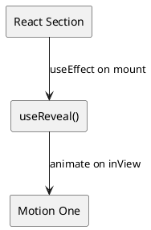

# SPEC-1–Wedding Website & RSVP System (React)

## Background

A single-page, elegant, mobile-first **wedding website** that presents essential event details and enables guests to confirm attendance via **Google Forms**. Submissions flow into **Google Sheets**, which serves as the couple’s lightweight admin dashboard for tracking RSVPs and guest counts. The site is static (HTML/CSS/JS) and hosted on **GitHub Pages** for high reliability and minimal maintenance.

**Users**
- **Primary:** Wedding guests (friends & family)
- **Secondary:** The couple (admins)

**Motivation**
- Provide guests all critical information (date, time, venue, parking, schedule) in one polished destination.
- Reduce ad‑hoc questions and ensure an accurate headcount.
- Keep operations simple—no custom backend, auth, or databases.

**Non-Functional Emphasis**
- Fast load, responsive design, clear readability/contrast.
- Reliability & security delegated to GitHub Pages and Google services.
- Content easy to update before the event.

## Requirements

### MoSCoW Prioritization

**Must Have**
- One-page static site built with **React** (Vite) and hosted on GitHub Pages.
- Mobile-first, responsive layout (smartphones, tablets, desktops).
- Sections: Hero (welcome + illustration), Schedule (17:00/18:30/19:10), Location & Venue, Parking Info, RSVP.
- RSVP via **embedded Google Form** with fields: First Name (req), Last Name (req), Number of Guests (req, numeric).
- Post-submission confirmation message (Google Forms default or custom text).
- Google Sheets as the admin dashboard receiving all form submissions.
- Admin sheet columns: Timestamp, First Name, Last Name, Number of Guests.
- Admin metrics: total RSVPs and total guests (sum of guest count) via formulas.
- Google Maps link/button to venue (R48 Hotel, 48 Rothschild Blvd, Tel Aviv).
- English-only content and formal-but-friendly tone in first-person plural ("We").
- Clear readability/contrast; fast-loading performance; no custom backend/auth.

**Should Have**
- Clean, modern, luxurious visual style with clear section separation in a single scroll.
- Parking information presented as concise, scannable text.
- Easy content updates (copy/images) via simple file edits.
- Basic accessibility: semantic HTML, keyboard focus order, alt text for the couple illustration, sufficient color contrast.
- Privacy posture: guest data handled only by Google Forms/Sheets; no third-party trackers beyond GitHub Pages/Google.

**Could Have**
- Subtle, lightweight animations (e.g., fade-in on scroll) that do not impact performance.
- Optional anchor navigation (sticky mini-menu) for quick jumps to sections.
- Optional favicon and Open Graph/Twitter preview images.
- Optional copy tweaks for RSVP confirmation (friendly, on-brand message).

**Won’t Have (for MVP)**
- Multi-language support.
- Guest accounts, email/SMS notifications, gift payments, or custom backend/database.
- Additional wedding-related event pages.

### Acceptance Criteria (Sampling)
- **Responsiveness:** Layout passes manual checks at 360px, 768px, 1024px, 1280px breakpoints with no horizontal scroll.
- **Performance:** Lighthouse Performance ≥ 90 on mobile for the main page with form embed.
- **RSVP Flow:** Submitting the Google Form creates a new row in the connected sheet with all required fields populated.
- **Admin Metrics:** Sheet formulas correctly compute total RSVPs and total guests; updates reflect within seconds of submission.
- **Venue Link:** Tapping the venue button opens Google Maps to R48 Hotel at the provided address.
- **Accessibility:** All images have descriptive alt text; headings are hierarchical (H1→H2→H3) and pass contrast checks.

## Method

### High-Level Architecture (React)
A fully static **React** single-page app hosted on **GitHub Pages**, embedding a **Google Form** for RSVP. Form submissions are stored in **Google Sheets**, which functions as the admin dashboard. No custom backend.

```plantuml
@startuml
skinparam componentStyle rectangle
actor Guest
actor Admin

component "Browser (Mobile/Desktop)" as Browser
component "GitHub Pages
(Static Hosting)" as GH
component "React App
(HTML/CSS/JS)" as App
component "Google Forms
(RSVP)" as GForm
component "Google Sheets
(Admin Dashboard)" as GSheet

Guest --> Browser : view site / submit RSVP
Browser --> GH : request static assets
GH --> Browser : index.html, JS, CSS
Browser --> GForm : form embed / submit
GForm --> GSheet : append row per submission
Admin --> GSheet : view, filter, formulas
@enduml
```

### Page & Content Structure (One-Pager)
- **Hero**: Title, date/time, couple illustration (PNG placeholder), RSVP button (scrolls to form).
- **Schedule**: Three items (17:00 Reception, 18:30 Ceremony, 19:10 Dinner).
- **Location**: Venue card with address and **Google Maps** button.
- **Parking**: Simple text block; TBD details.
- **RSVP**: Embedded Google Form (iframe) + short note about deadline (TBD).
- **Footer**: Minimal copyright.

### React Project Structure (Vite)
```
/ (repo root)
├─ index.html
├─ package.json
├─ tailwind.config.cjs
├─ postcss.config.cjs
├─ public/
│  ├─ images/couple.png
│  └─ favicon.ico
├─ src/
│  ├─ App.jsx
│  ├─ main.jsx
│  ├─ components/
│  │  ├─ Hero.jsx
│  │  ├─ Schedule.jsx
│  │  ├─ Location.jsx
│  │  ├─ Parking.jsx
│  │  └─ RsvpEmbed.jsx
│  ├─ hooks/
│  │  └─ useReveal.js
│  └─ data/
│     ├─ schedule.js
│     └─ site.js
├─ .github/workflows/deploy.yml
└─ README.md
```

### Styling: Tailwind CSS (Custom Theme)
- Define brand scale (colors, fonts, spacing, radius) in `tailwind.config.cjs`.
- Create small component classes with `@apply` in `src/index.css`.

### Animations: Motion One (React)
Use a tiny hook to animate on section visibility with **Motion One**. Keep effects subtle to preserve Lighthouse.



### RSVP: Google Forms Embed
- Fields: First Name (required), Last Name (required), Number of Guests (required, numeric).
- **Edit after submit: ENABLED**.
- Use iframe embed in `RsvpEmbed.jsx` inside a responsive container.

### Admin Dashboard: Google Sheets
- Columns: Timestamp, First Name, Last Name, Number of Guests.
- KPI formulas: `=COUNTA(A2:A)` and `=SUM(D2:D)` on a Dashboard tab.
- Restricted sharing to the couple’s Google accounts.

### Performance Budget & SEO Basics
- Lighthouse (mobile) target **≥ 90**.
- JS budget **≤ 100KB gz**; images **≤ 200KB** total.
- `preconnect` to Google Forms; minimal metadata (title, description, Open Graph).

### Security/Privacy
- No PII on the site; RSVP data lives in Google.
- Lazy-load the iframe; no third-party analytics by default.

## Implementation

### 1) Project Bootstrap (Vite + React)
```bash
npm create vite@latest wedding-website -- --template react
cd wedding-website
npm install
npm install -D tailwindcss postcss autoprefixer
npx tailwindcss init -p
npm install motion
```
**Tailwind wiring**
- `tailwind.config.cjs` and `src/index.css` as shown below.
```js
// tailwind.config.cjs
module.exports = {
  content: ['./index.html','./src/**/*.{js,jsx}'],
  theme: {
    extend: {
      colors: {
        brand: {50:'#faf8f7',100:'#f2ece8',200:'#e4d8cf',300:'#d1bfae',400:'#bfa58f',500:'#a98a72',600:'#8c6f5a',700:'#6f5746',800:'#4f3e32',900:'#2e251e'}
      },
      fontFamily: {
        display: ['"Playfair Display"','serif'],
        body: ['Inter','system-ui','sans-serif']
      },
      borderRadius: { xl: '1rem', '2xl': '1.25rem' },
    }
  },
  plugins: []
};
```
```css
/* src/index.css */
@tailwind base; @tailwind components; @tailwind utilities;
.btn { @apply inline-block rounded-xl px-6 py-3 bg-brand-700 text-white; }
.card { @apply rounded-2xl border p-6; }
```

### 2) Data
```js
// src/data/site.js
export const site = {
  title: 'Our Wedding',
  dateISO: '2026-09-10T17:00:00+03:00',
  venueName: 'R48 Hotel',
  address: '48 Rothschild Boulevard, Tel Aviv',
  mapsUrl: 'https://maps.google.com/?q=R48+Hotel+Tel+Aviv',
  rsvpNote: 'Please RSVP by <TBD date>.',
};
```
```js
// src/data/schedule.js
export const schedule = [
  { time: '17:00', title: 'Wedding Reception' },
  { time: '18:30', title: 'Wedding Ceremony' },
  { time: '19:10', title: 'Dinner' },
];
```

### 3) App & Components
*(Includes index.html, main.jsx, App.jsx and section components as shown in the canvas.)*

### 4) Google Forms & Sheets Setup
- Create Google Form; enable **Edit after submit**; copy iframe `src` into `RsvpEmbed.jsx`.
- Link to Sheets; add KPI formulas on Dashboard tab.

### 5) Accessibility & Performance
- Alt text, heading order, focus styles; compress PNG; Lighthouse mobile ≥ 90.

### 6) CI/CD – GitHub Pages
```yaml
# .github/workflows/deploy.yml
name: Deploy Vite React to GitHub Pages
on: { push: { branches: [ main ] } }
permissions: { contents: read, pages: write, id-token: write }
jobs:
  build:
    runs-on: ubuntu-latest
    steps:
      - uses: actions/checkout@v4
      - uses: actions/setup-node@v4
        with: { node-version: 20 }
      - run: npm ci
      - run: npm run build
      - uses: actions/upload-pages-artifact@v3
        with: { path: './dist' }
  deploy:
    needs: build
    runs-on: ubuntu-latest
    environment:
      name: github-pages
      url: ${{ steps.deployment.outputs.page_url }}
    steps:
      - id: deployment
        uses: actions/deploy-pages@v4
```
If publishing as a project page, set Vite `base` in `vite.config.js`:
```js
import { defineConfig } from 'vite';
import react from '@vitejs/plugin-react';
export default defineConfig({ plugins: [react()], base: '/wedding-website/' });
```

## Milestones

- **M1 Setup** (Vite + React, Tailwind, Motion One, GH Pages CI) — deploy succeeds.
- **M2 Content & RSVP** (copy, Google Form embed, Sheets KPIs) — test submissions OK.
- **M3 Theme & Animations** (custom Tailwind theme, subtle reveals, Maps link) — budgets met.
- **M4 QA & Launch** (a11y, cross-browser, final copy) — Lighthouse mobile Perf ≥ 90, A11y ≥ 95, SEO ≥ 90.

## Gathering Results
- Verify RSVP E2E (submit + edit) updates Sheet and KPIs.
- Deep-link anchors work; Maps opens correct venue.
- Admins can export CSV/Excel and manually adjust rows without breaking totals.

## Launch Day Checklist
- Finalize copy in `src/data/*`; compress and replace `public/images/couple.png`.
- Confirm **Edit after submit** enabled; confirmation message set.
- Test RSVP on mobile/desktop; verify Sheet totals.
- Run Lighthouse (mobile) and maintain **Perf ≥ 90**.
- Ensure GitHub Pages live with HTTPS; (optional) custom domain + CNAME.

## Need Professional Help in Developing Your Architecture?
Please contact me at [sammuti.com](https://sammuti.com) :)
